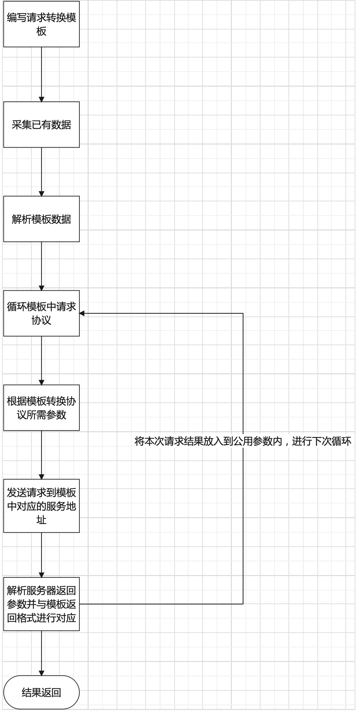

# 一、 背景

&nbsp;&nbsp;&nbsp;&nbsp;&nbsp;在应用之中往往要兼容多种功能相同第三方的服务， 比如电子签章系统中的`第三方印章服务`与`第三方制证服务`，
需要在应用内部去选择哪家服务，后续的删除与扩展第三方服务只能进行单独开发并更新运行环境代码包的方式才能完成<br />
&nbsp;&nbsp;&nbsp;&nbsp;长此以往为以后的第三方扩展与快速适配带来了很多的麻烦，随着项目内兼容的同类型服务越多，程序的稳定性就会越来越差

# 二、目的

针对上述问题，特开发此库，已解决以下问题

1. 需要重复编写适配代码(参数不同、返回值不同、流程不同等)，并融合到主干流程
2. 无法快速适配，所有新来厂家只能挨个开发
3. 开发完成之后，需要重新在生成环境中部署源程序，为程序健壮性带来隐患

# 三、运行流程



开发人员编写适配模板配置文件 -> 应用系统将采集到的数据传递到本工具 -> 本工具解析开发人员编写的配置模板 -> 提取目标服务的协议以及参数等其他信息 -> 按模板中制定的规则组织数据并发送至目标服务 -> 接收目标服务响应数据 ->
将接收到的数据按照模板内指定的数据格式进行拼装 -> 将结果返回至应用

# 四、模板与数据类型

## 4.1 讲解

```yaml
# 调用过程，数组格式( 也就是循环请求, 目前支持的请求转发类型: http、https其他类型暂不支持 )
process:
  # 转发http请求
  - http:
      # 描述信息，一般用来给人或者前端的操作人员看，工具内部不使用
      desc:
      # 字符串模板格式 要访问的路径, 可直接从ip开始写 http:// 会自动补全, 在连接字符串内可以拼变量，在解析过程中会将变量内容替换到字符串相应位置
      url: 127.0.0.1:8183?a={{ .out. }}
      # http的请求方式默认不填为get, 大小写都可
      method: post
      # 字符串模板格式 要发送的头信息, 内部为 key: value
      headers:
        Content-Type: application/json
      # 字符串模板格式 请求体, 可以为json串等格式，传递时通过requestBody进行传送
      reqBody: |
        {"a": "b"}
      # 结果解析器
      responseParser:
        # 简单结果解析器，将目标服务返回的值进行简单解析，多种简单解析器请用 | 线隔开，下一个解析器处理上一个解析器处理完成的结果, 现支持如下几种:
        # 1. bse64: base64解码
        # 2. hex: hex解码
        # 3. json: json解码变为golang中的interface
        simple: base64 | hex | json
        # js代码模板 当目标服务返回值的状态码不为200的时候调用此内容，并将状态码与目标服务器作为变量进行传入
        errFn: |
          statusCode = 404
          if ($.Res.statusCode != "404") {
            throw "不支持的错误响应"
          }
          const res = {
            "error": true,
            "msg": "未知的异常, 状态码 => " + $.Res.StatusCode
          }
          res
        # 正常结果的处理与转换函数(js代码模板), 数组格式，可以有多组函数, 将响应状态码与结果进行传入
        fns:
          - $.Res
          - Data: 原始自负循环
          - Obj: Json转的对象
          - StatusCode:
          - |
            if ($.Res.Obj.error) {
              throw $.Res.Obj.msg
            }
            $.Res.Obj.result

  # 转发https请求, 和http请求参数基本一致，只是在 http 请求之上扩充了关于ssl/tls方面的配置
  - https:
      # ca根证书pem
      caCertPem:
      # 客户端证书pem
      clientCertPm:
      # 客户端证书私钥
      clientKeyPem:
      # 是否跳过http认证 true/false, 如果为true证书相关配置将不在生效，也可不配，默认为false
      skipVerify:
```

## 4.2 字符串模板内置变量

| 参数名称 | 描述 | 类型 |
| ------  | --- | ---- |
| .Out | 外部参数 | Object |
| .Http | http每次的请求与响应 | ProcessReqAndResContainerData |
| .Https | https每次的请求与响应 | ProcessReqAndResContainerData |
| .Req | 本次的请求数据 | ProcessReqData |
| .Res | 本次的响应数据 | ProcessReqData |
| .Prev | 响应解析器中的处理函数上一次的返回结果 | Object |
| .History | 响应解析器中的处理函数每处理成功一次就像本参数中加一次对应的返回结果 | []Object |

## 4.3 字符串模板内置函数

| 函数名称 | 描述 | 参数 | 示例 |
| ------- | --- | --- | ---- |
| index | 获取数据下标内的数据 | object, int | index array 0 |
| randHex | 随机指定位数的16进制字符串 | int | randHex 16 |
| decodeJson | 将json字符串转换为Object | string | decodeJson "{\"a\":1}"|
| encodeJson | 将Object转换为string | decodeJson obj |
| decodeHex | hex解码 | string | decodeHex str |
| encodeHex | hex编码 | string | encodeHex str |
| decodeBase64 | Base64解码 | string | decodeBase64 str |
| encodeBase64 | Base64编码 | string | encodeBase64 str |

## 4.4 JS模板内置变量

> js模板中暂时只有内置变量，没有内置函数

| 参数名称 | 描述 | 类型 |
| ------  | --- | ---- |
| $.Out | 外部参数 | Object |
| $.Http | http每次的请求与响应 | ProcessReqAndResContainerData |
| $.Https | https每次的请求与响应 | ProcessReqAndResContainerData |
| $.Req | 本次的请求数据 | ProcessReqData |
| $.Res | 本次的响应数据 | ProcessReqData |
| $.Prev | 响应解析器中的处理函数上一次的返回结果 | Object |
| $.History | 响应解析器中的处理函数每处理成功一次就像本参数中加一次对应的返回结果 | []Object |

## 4.5 数据类型

```go

// 调用数据
type ProcessData struct {
	// 外部传入参数
    Out interface{}
    // Http请求与结果
    Http    *ProcessReqAndResContainerData
    // Https请求与结果
    Https   *ProcessReqAndResContainerData
    // 本次请求
    Req     *ProcessReqData
    // 本次结果
    Res     *ProcessResData
    // 上一次调用响应处理函数返回的结果
    Prev    interface{}
    // 调用响应处理函数返回的结果合集
    History []interface{}
}

// 请求与响应容器
type ProcessReqAndResContainerData struct {
	// 上一次请求与响应的数据
    Prev *ProcessReqAndResData
    // 请求与响应的历史列表
    List []*ProcessReqAndResData
}

// 请求与想听数据
type ProcessReqAndResData struct {
	// 请求数据
    Req *ProcessReqData
    // 响应数据
    Res *ProcessResData
}

// 请求数据
type ProcessReqData struct {
	// 请求的reqBody
    Data    string
    // 请求使用的header
    Headers map[string]string
}

// 响应数据
type ProcessResData struct {
	// 目标服务响应的原始数据
    Data       string
    // 目标服务响应的状态码
    StatusCode int
    // 目标服务响应的原始数据转换为的对象，只有当响应处理器中的simple中调用了json才会有值
    Obj        interface{}
}

```